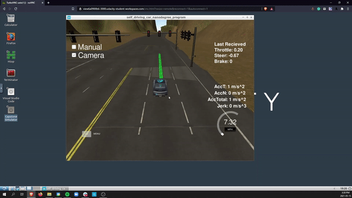
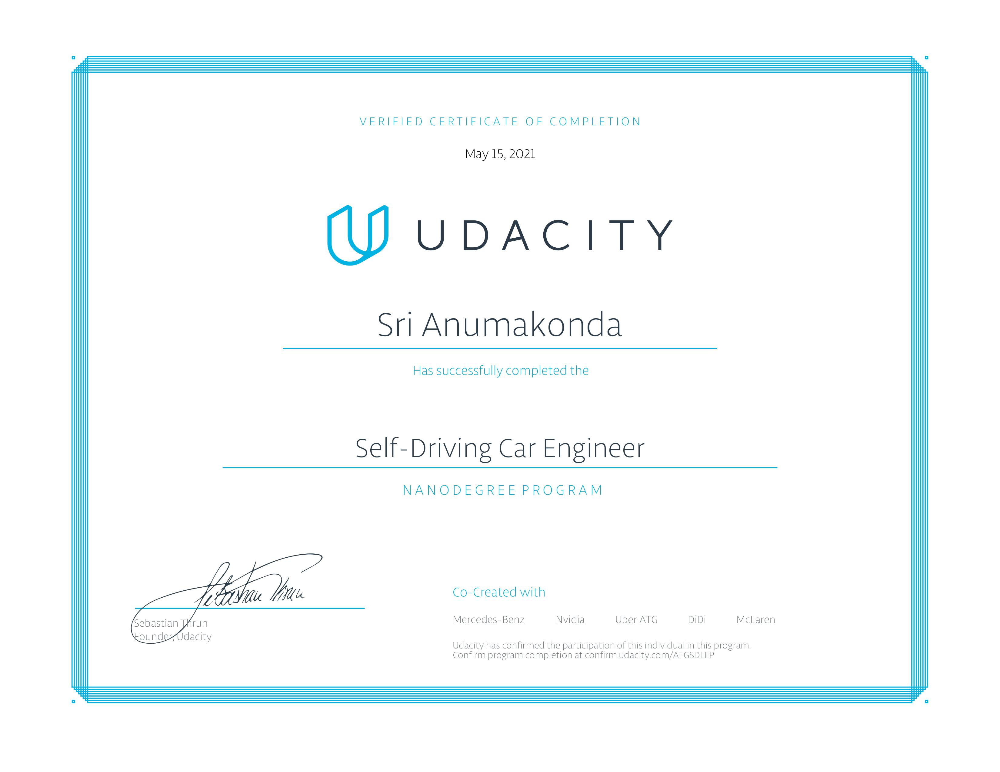

## Hey there 👋

14 and have built my own self-driving car. Graduated from the Udacity Become a Self-Driving Car nanodegree within 2.5 months and have become a certified engineer.

### What I've built
- A self-driving car

- Played around with imitation learning

- Created my own alternative to YOLO by leveraging the HIstogram of Oriented Gradients and ML algorithms such as SVMs to create an Object Detection pipeline

### Connect with me
- <a href="https://www.linkedin.com/in/srianumakonda/">Linkedin</a>
- <a href="https://twitter.com/srianumakonda">Twitter</a>
- info@srianumakonda.com

### Miscellaneous

&nbsp;

